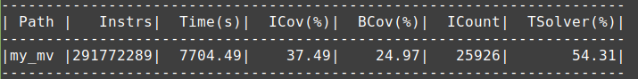

# KLEE

KLEE je alat za simboličko izvršavanje koji je napravljen na LLVM-u. Implementiran je u programskom jeziku C++. Omogućava da se programi koji su napisani na programskim jezicima C i C++ simbolički izvršavaju, odnosno da se statički, bez pokretanja otkrivaju potencijalne greške. Alat daje informaciju o ulaznim podacima koji mogu dovesti do određene greške. U radu je alat obogaćen novim algoritmom za pretragu stabla stanja tokom simboličkog izvršavanja programa. Algoritam predstavlja kombinaciju grafovskih algoritam pretrage u dubinu i pretrage u širinu.

# Organizacija repozitorijuma

Repozitorijum je organizovan u nekoliko direktorijuma:
  - tekst, gde se nalazi tekst master rada.
  - kod, gde se nalazi osnovni kod alata KLEE koji je nadograđen novim algoritmom za pretragu stabla stanja.
  - testovi, gde se nalaze svi programi GNU Coreutils-a koji su korišćeni kao realni programi pri testiranju alata i na kojima su kasnije sprovedeni testovi za poređenje algoritma koji je opisan u radu sa algoritmima koji su predložili autori alata.
  - rezultati, gde se nalaze rezultati istraživanja. Direktorijum sadrži veći broj direktorijuma. Direktorijumi sa prefiksom covnew predstavljaju rezultate pokretanja algoritma koji predlažu autori alata, dok oni sa prefiksom my predstavljaju rezultate pokretanja programa sa algoritmom opisanim u radu.

# Instalacija

Za korišćenje alata KLEE je neophodno instalirati sam alat. Uputstva se mogu naći na adresi http://klee.github.io/build-llvm38/. Verzija alata koja je nadograđena u ovom radu je stabilna verzija KLEE 2.1 iz marta 2020. godine. Kako bi bilo moguće koristiti algoritam BFS-DFS koji je opisan u radu potrebno je klonirati ovaj repozitorijum. Sva ostala uputstva za instalaciju su ista kao i na navedenoj adresi.

Alat je moguće skinuti i preko Docker-a, a sva uputstva su dostupna na https://klee.github.io/docker/.

Kako bi alat radio potrebno je instalirati LLVM i Clang. Uputstvo za instalaciju LLVM-a za Ubuntu se može naći na adresi https://klee.github.io/build-llvm38/. Zvanična strana LLVM-a, kao i sve dodatne informacije se nalaze na https://releases.llvm.org/3.8.0/docs/GettingStarted.html. Verzija LLVM-a i Clang-a koju je koristio autor ovog rada je 6.0.

Da bi bilo moguće sprovoditi testove na način na koji su to radili autori alata potrebno je instalirati GNU Coreutils. Detaljna uputstva za ovaj postupak su data na https://klee.github.io/tutorials/testing-coreutils/.

# Pokretanje

Nakon što su instalirani svi potrebni alati, alat KLEE se pokreće sa `klee ime_fajla.bc`. KLEE radi sa LLVM kodom čija je ekstenzija `.bc`. Kako bi se dobio ovakav kod koristi se Clang. Komanda kojom od `.c` fajla dobijamo `.bc` verziju je `clang-6.0 -emit-llvm -c -g ime_fajla.c`. U direktorijumu testovi već postoje `.bc` verzije svih programa.

Pored ostalih parametara moguće je i dati specifikaciju o tome koju pretragu želimo da koristimo za pretraživanje grafa stanja simboličkog izvršavanja. To se radi pomoću argumenta `--search` prilikom pokretanja alata. Na primer `klee --search=dfs ime_fajla.bc`. Na ovaj način će se vršiti pretraga stabla stanja algoritmom DFS. Za korišćenje algoritma koji je opisan u radu je potrebno proslediti bfs-dfs kao parametar pretrazi. `klee --search=bfs-dfs ime_fajla.bc`.

# Izlaz iz alata

Kao izlaz iz alata se dobija direktorijum u kome se nalaze testovi koji odgovaraju putanjama kroz program koje su otkrivene simboličkim izvršavanjem. Za svaku putanju su date vrednosti ulaznih podataka koje dovode do kretanja kroz istu. Da bi se pročitale ulazne vrednosti podataka koristi se `ktest-tool ime_fajla.ktest` pri čemu su fajlovi sa ekstenzijom `.ktest` automatski generisani od strane alata. Takođe se za svako pokretanje kreira direktorijum u kome se nalaze ovi testovi. Ukoliko se upotrebi komanda `klee-stats ime_direktorijuma` može se dobiti informacija o pokrivesnoti naredbi, pokrivesnoti grana u programu, vremenu izvršavanja, broju izvršenih LLVM instrukcija.

# Primer pokretanja

Primer pokretanja alata za jedan od programa iz GNU Coreutils-a je:

`klee --simplify-sym-indices --write-cvcs --write-cov --output-module --max-memory=1000 --disable-inlining --optimize --use-forked-solver --use-cex-cache --libc=uclibc --posix-runtime --external-calls=all --only-output-states-covering-new --max-sym-array-size=4096 --max-time=720min --watchdog --max-memory-inhibit=false --max-static-fork-pct=1 --max-static-solve-pct=1 --max-static-cpfork-pct=1 --switch-type=internal --search=bfs-dfs -memory-part=0.4 -instructions-since-covered-new=10000 mv.bc --sym-args 0 1 10 --sym-args 0 2 2 --sym-files 1 8 --sym-stdin 8 --sym-stdout`

# Primer izlaza

